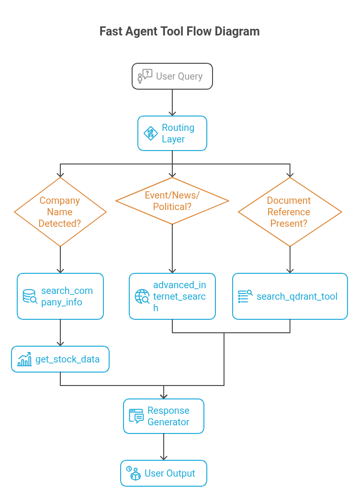
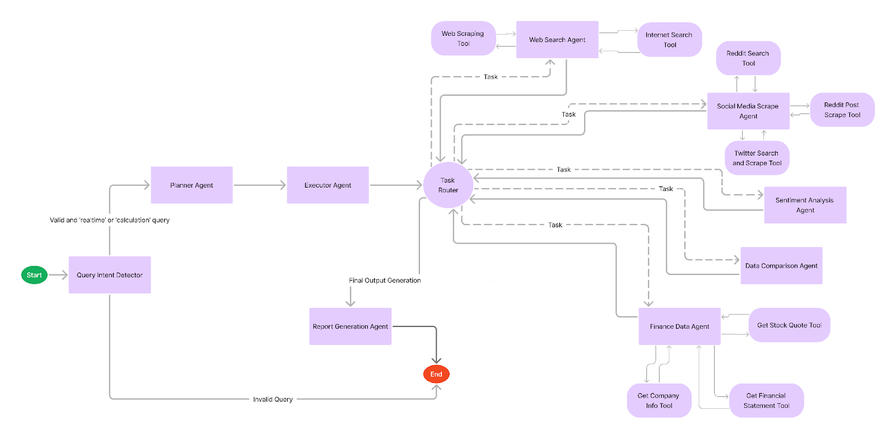
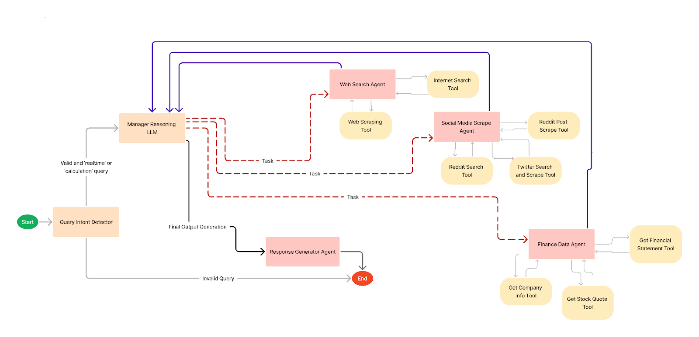

# TheNZT - Multi-Agent Finance Query System


<p align="center">
  <a href="https://github.com/IAI-solution/TheNZT_Open_Source/stargazers">
    
  </a>

  <a href="https://github.com/IAI-solution/TheNZT_Open_Source/network/members">
    
  </a>
</p>

TheNZT is a powerful multi-agent finance query processing system designed to process and respond to finance-related queries efficiently. Leveraging advanced LLM multi-agent collaboration, it provides intelligent solutions for Finance, Company-specific, and Market-related queries.

## Table of Contents

- [Features](#features)
- [Prerequisites](#prerequisites)
- [Installation](#installation)
  - [Local Development Setup](#local-development-setup)
  - [Docker Setup](#docker-setup)
- [Configuration](#configuration)
- [Usage](#usage)
- [Project Structure](#project-structure)
- [API Documentation](#api-documentation)
- [Contributing](#contributing)
- [Troubleshooting](#troubleshooting)
- [License](#license)

## Features

- 🤖 Multi-agent LLM collaboration for finance queries
- 📈 Real-time stock price and market data
- 🏢 Company-specific financial analysis
- 📊 Market trend summarization
- 🔍 Intelligent query processing
- 🚀 Fast and scalable architecture
- 🎨 Modern React frontend with Next.js
- ⚡ High-performance FastAPI backend

## Architecture Overview
In this system we mainly have 3 agents:

### 1. Fast Agent (Lite)
#### Overview
The Fast Agent (Insight Agent) is an AI-powered assistant designed to deliver rapid, accurate insights on companies, markets, through a modular, multi-step architecture. It processes natural language queries using a system prompt to enforce tone and structure, routes them to specialized tools (e.g., company ticker resolution, stock data retrieval, news search, and search via APIs like Financial Modeling Prep), and generates clear, brand-aligned markdown responses with inline citations.

#### Workflow
1. **User Query:** The agent receives a natural language question (e.g., “Why is Tesla’s stock falling?”).
2. **Prompt Formatting:** The system formats the query using a predefined instruction set governing tone, structure, tool use, citations, and safety.
3. **Routing Logic:** A control layer determines which tool(s) to trigger based on the query’s intent (e.g., finance, news).
4. **Tool Execution:** The chosen tool(s) fetch relevant data (e.g., ticker lookup, stock prices, news).
5. **Response Generation:** The LLM generates a clear, well-cited markdown response using all retrieved data.
6. **Output to User:** The final response is delivered, including inline sources, tables (if needed), and a polite, brand-aligned tone.



### 2. Planner Agent (Core)

#### Overview
The Planner Agent (Core) architecture is a structured, multi-agent system that processes user queries through a fixed, sequential plan. Starting with the Query Intent Detector to validate relevance, the Planner Agent creates a multi-step strategy, reviewed by the Executor Agent, which is executed by specialized agents like Web Search, Social Media Scrape, Finance Data, Sentiment Analysis, and Data Comparison. The Response Generator compiles a comprehensive, user-friendly response, making this approach ideal for systematic handling of complex queries.

#### Agents Used
- **Query Intent Detector**: Validates the relevance of user queries.
- **Planner**: Creates a fixed, multi-step plan involving specialized agents.
- **Executor**: Reviews and finalizes the plan created by the Planner.
- **Web Search**: Retrieves information from web sources.
- **Social Media Scrape**: Gathers data from social media platforms.
- **Finance Data**: Collects and processes financial information.
- **Sentiment Analysis**: Analyzes the sentiment of collected data.
- **Data Comparison**: Compares data from multiple sources for consistency and accuracy.
- **Response Generator**: Compiles and formats the final response for the user.



#### Workflow
1. **Query Intake**: The user query is received and processed by the **Query Intent Detector** to ensure relevance.
2. **Plan Creation**: The validated query is sent to the **Planner Agent**, which generates a fixed, multi-step plan involving the appropriate specialized agents.
3. **Plan Review**: The **Executor Agent** reviews and finalizes the plan.
4. **Task Routing**: A **Task Router** (implied component) sequentially assigns tasks to the agents specified in the plan, such as **Web Search**, **Social Media Scrape**, **Finance Data**, **Coding**, **Sentiment Analysis**, and **Data Comparison**.
5. **Data Processing**: Each assigned agent collects and analyzes data according to its specialization.
6. **Response Generation**: The processed information is passed to the **Response Generator Agent**, which compiles and formats the final response.
7. **Response Delivery**: The final response is delivered to the user.

#### Key Characteristic
The Base Agent Architecture follows a **pre-defined, sequential plan** generated at the beginning of the process, ensuring a structured and systematic approach to handling user queries.

### 3. Reasoning Agent (Pro)

#### Overview
The Reasoning Agent (Pro) architecture is a dynamic, iterative system that efficiently handles user queries through adaptive task assignment. After the Query Intent Detector validates relevance, the Manager Agent analyzes the query and assigns tasks one at a time to specialized agents (Web Search, Social Media Scrape, or Finance Data), iterating based on incoming data until sufficient information is gathered. The Response Generator then crafts a tailored response, making this flexible system ideal for diverse, evolving queries.

#### Agents Used
- **Query Intent Detector**: Validates the relevance of the user query.
- **Manager Agent**: Analyzes the query and current state, assigns tasks to specialized agents, and orchestrates the workflow.
- **Web Search Agent**: Retrieves relevant information from web sources.
- **Social Media Scrape Agent**: Gathers data from social media platforms.
- **Finance Data Agent**: Collects and processes financial data.
- **Response Generator Agent**: Crafts the final response for the user.



#### Workflow
1. **Query Validation**: The user query is received and validated for relevance by the Query Intent Detector.
2. **Query Analysis**: The validated query is passed to the Manager Agent, which analyzes the query and the current state.
3. **Task Assignment**: The Manager Agent assigns a single task to the most appropriate specialized agent (Web Search, Social Media Scrape, Finance Data, or Coding) based on the query's requirements.
4. **Iterative Reasoning**: The Manager Agent receives the result from the specialized agent, reasons about the next best step, and assigns another task if necessary. This loop continues iteratively until sufficient information is gathered.
5. **Response Generation**: Once enough information is collected, the Manager Agent tasks the Response Generator Agent to create the final response.
6. **Response Delivery**: The final response is delivered to the user.

#### Key Characteristic
The system employs **dynamic, iterative reasoning** to make task decisions one at a time, adapting the process as new information is gathered, ensuring flexibility and efficiency in handling diverse queries.

## Prerequisites

Before you begin, ensure you have the following installed on your system:

- **Python 3.10+** - [Download Python](https://www.python.org/downloads/)
- **Node.js 16+** and **npm** - [Download Node.js](https://nodejs.org/)
- **Git** - [Download Git](https://git-scm.com/downloads)
- **Docker & Docker Compose** (optional, for containerized setup) - [Download Docker](https://www.docker.com/get-started)

## Installation

### Local Development Setup

#### 1. Clone the Repository

```bash
git clone git@github.com:IAI-solution/TheNZT_Open_Source.git
cd TheNZT_Open_Source
```

#### 2. Environment Configuration

Create a `.env` file in the **project root** with your API keys (check .env.example):

```env
# Required API Keys
-GEMINI_API_KEY=your_gemini_api_key_here
-TAVILY_API_KEY=your_tavily_api_key_here
-FMP_API_KEY=your_fmp_api_key_here


# Database Configuration
MONGO_URI=

# Redis Configuration

REDIS_HOST=
REDIS_PORT=
REDIS_USERNAME=
REDIS_PASSWORD=


# Frontend Configuration

NEXT_PUBLIC_BASE_URL=http://localhost:8000

```

## 2.1 Configure External Services

### FMP 

1. Go to [FMP](https://site.financialmodelingprep.com/) and log in (create a free account if you don't have one).

2. Get the free API key.

3. In the .env file, place the FMP API key.

```
FM_API_KEY=your_fmp_api_key_here
```

### Tavily

1. Go to [Tavily](https://www.tavily.com/) and log in (create a free account if you don't have one).

2. Get the free API key.

3. In the .env file, place the Tavily API key.

```
TAVILY_API_KEY=your_tavily_api_key_here
```

### GEMINI

1. Go to [Google AI Studio](https://aistudio.google.com/) and log in.

2. Get the free API key.

3. In the .env file, place the Tavily API key.

```
GEMINI_API_KEY=your_gemini_api_key_here
```

### MongoDB (Database)

1. Go to [MongoDB Atlas](https://www.mongodb.com/cloud/atlas) and log in (create a free account if you don't have one).

2. Create a free cluster.

3. In the cluster dashboard, click **Connect** → **Connect your application**.

4. Copy the connection string provided. Example:
```
mongodb+srv://<username>:<password>@cluster0.abcd.mongodb.net/<dbname>?retryWrites=true&w=majority
```

For more details, check out the [MongoDB documentation](https://www.mongodb.com/docs/manual/reference/connection-string/).

### Redis (Cache / Broker)

1. Go to [Redis Cloud](https://redis.com/cloud/overview/) and sign in (create a free account if needed).

2. Create a free database (recommended for development).

3. In the dashboard, open your database and click **Connect**.

4. Choose **Connect with Client**, and in the language dropdown, select **Python**.

5. Copy the provided details:
- Host
- Port
- Username (often default)
- Password

6. Paste them into your `.env` file under the Redis section.

For more details, check out the [Redis Cloud documentation](https://cloud.redis.io/#/add-subscription/essential).

> **Note**: You can use `.env.example` as a template if it exists in the repository.


#### 3. Backend Setup

**Step 3.1: Install UV Package Manager**

UV is a fast Python package installer. Install it using:

```bash
# On macOS/Linux
curl -LsSf https://astral.sh/uv/install.sh | sh

# On Windows (PowerShell)
powershell -c "irm https://astral.sh/uv/install.sh | iex"

# Alternative: Install via pip
pip install uv
```

**Step 3.2: Create Virtual Environment**

```bash
# Create virtual environment with Python 3.11
uv venv --python 3.11

# Activate virtual environment
# On macOS/Linux:
source .venv/bin/activate

# On Windows:
# .venv\Scripts\activate
```

**Step 3.3: Install Dependencies**

```bash
uv pip install -r requirements.txt
```

**Step 3.4: Start Backend Server**

```bash
# Run the FastAPI server with auto-reload
uvicorn src.backend.app:app

# Alternative: If you're already in src/backend directory
uvicorn app:app
```

The backend will be available at [http://localhost:8000](http://localhost:8000)

#### 4. Frontend Setup

**Step 4.1: Navigate to Frontend Directory**

```bash
# Open a new terminal window/tab and navigate to frontend
cd src/frontend
```

**Step 4.2: Install Dependencies**

```bash
# Install Node.js dependencies
npm install --legacy-peer-deps

# Alternative: Use yarn if preferred
# yarn install
```

**Step 4.3: Configure Environment**

```bash
# Create frontend environment file
echo 'NEXT_PUBLIC_BASE_URL="http://localhost:8000"' > .env.local
```

**Step 4.4: Start Frontend Server**

```bash
# Start Next.js development server
npm run dev

# Alternative commands
# npm start (for production build)
# npm run build (to create production build)
```

The frontend will be available at [http://localhost:3000](http://localhost:3000)

### Docker Setup

For a containerized setup that handles both backend and frontend:

**Option 1: Quick Start**

```bash
# Build and run all services
docker compose -f docker/docker-compose.yml up --build

# Run in detached mode
docker compose -f docker/docker-compose.yml up --build -d
```

<!-- **Option 2: Individual Services**

```bash
# Build only backend
docker compose -f docker/docker-compose.yml build backend

# Build only frontend  
docker compose -f docker/docker-compose.yml build frontend

# Start specific service
docker compose -f docker/docker-compose.yml up backend
``` -->

**Stopping Docker Services**

```bash
# Stop all services
docker compose -f docker/docker-compose.yml down

# Stop and remove volumes
docker compose -f docker/docker-compose.yml down -v
```

## Configuration

### Backend Configuration

The backend can be configured through environment variables:

| Variable | Description |
|----------|-------------|
| `GEMINI_API_KEY` | Gemini API key for LLM |
| `TAVILY_API_KEY` | Tavily API key for search |
| `FMP_API_KEY` | Financial Modeling Prep API key  |

* LLM models can be configured in this file: src/ai/llm/config.py

### Frontend Configuration

The frontend uses these environment variables:

| Variable | Description | Default |
|----------|-------------|---------|
| `NEXT_PUBLIC_BASE_URL` | Backend API URL | `http://localhost:8000` |
| `NEXT_PUBLIC_APP_NAME` | Application name | `TheNZT` |

## Usage

### Getting Started

1. **Ensure both servers are running**:
   - Backend at [http://localhost:8000](http://localhost:8000)
   - Frontend at [http://localhost:3000](http://localhost:3000)

2. **Open your browser** and navigate to [http://localhost:3000](http://localhost:3000)

3. **Register or log in**:
   - For new users, during registration, after entering name, email, and password, an OTP will be generated and displayed in the console for verification.
   - Once verified, you can log in and start asking finance-related queries.

4. **Start asking finance-related topics.**

### Example Queries

**Stock Information**
```
What is the latest stock price for Apple?
Get me the current market cap of Tesla
Show me the P/E ratio for Microsoft
```

**Market Analysis**
```
Summarize recent market trends
What are the top gainers today?
Analyze the tech sector performance this week
```

**Company Financials**
```
Get the quarterly financials for Tesla Inc.
What is Amazon's revenue growth rate?
Compare the debt-to-equity ratio of Apple vs Microsoft
```

**Market Research**
```
What are the upcoming earnings announcements?
Analyze the cryptocurrency market trends
Get me news about renewable energy stocks
```

## Project Structure

```
insight-bot/
├── .venv/                        # Python virtual environment
├── docker/
│   ├── docker-compose.yml
│   └── Dockerfile
├── docs/
│   ├── architectures/
│   ├── graphs/
│   ├── images/
│   ├── individual_agents/
│   ├── llm/
│   ├── schemas/
│   └── tools/
├── src/
│   ├── ai/                        
│   │   ├── agent_prompts/
│   │   ├── agents/
│   │   │   ├── base_agent.py
│   │   │   ├── coding_agent.py
│   │   │   ├── data_comparison_agent.py
│   │   │   ├── db_search_agent.py
│   │   │   ├── executor_agent.py
│   │   │   ├── fast_agent.py
│   │   │   ├── finance_data_agent.py
│   │   │   ├── intent_detector.py
│   │   │   ├── manager_agent.py
│   │   │   ├── map_agent.py
│   │   │   ├── planner_agent.py
│   │   │   ├── response_generator_agent.py
│   │   │   ├── sentiment_analysis_agent.py
│   │   │   ├── social_media_agent.py
│   │   │   ├── summarizer.py
│   │   │   ├── task_validator.py
│   │   │   ├── utils.py
│   │   │   ├── validation_agent.py
│   │   │   └── web_search_agent.py
│   │   ├── ai_schemas/
│   │   │   ├── graph_states.py
│   │   │   ├── structured_responses.py
│   │   │   ├── tool_structured_input.py
│   │   │   └── validation_utils.py
│   │   ├── chart_bot/
│   │   │   ├── old/
│   │   │   │   ├── financial_tool.py
│   │   │   │   ├── generate_related_qn.py
│   │   │   │   ├── llm_react_agent.py
│   │   │   │   ├── moving_average.py
│   │   │   │   ├── price_change.py
│   │   │   │   ├── relative_strength.py
│   │   │   │   ├── tavily_search.py
│   │   │   │   └── volatility.py
│   │   ├── llm/
│   │   │   ├── config.py
│   │   │   └── model.py
│   │   ├── stock_prediction/
│   │   │   ├── stock_prediction_functions.py
│   │   │   └── stock_prediction.py
│   │   ├── tools/
│   │   │   ├── finance_scraper_utils.py
│   │   │   ├── graph_gen_tool_system_prompts.py
│   │   │   ├── graph_gen_tool.py
│   │   │   ├── internal_db_tools.py
│   │   │   ├── map_tools.py
│   │   │   ├── social_media_tools.py
│   │   │   ├── web_search_tools.py
│   │   │   └── insight_graph.py
│   │   └── __init__.py
│   ├── backend/                    
│   │   ├── api/                    
│   │   │   ├── __init__.py
│   │   │   ├── auth.py
│   │   │   ├── chat.py
│   │   │   ├── session.py
│   │   │   └── user.py
│   │   ├── core/                   
│   │   │   ├── __init__.py
│   │   │   ├── api_limit.py        
│   │   │   ├── limiter.py          
│   │   │   └── JWT.py              
│   │   ├── db/                      
│   │   │   ├── __init__.py
│   │   │   ├── mongodb.py
│   │   │   ├── qdrant.py
│   │   │   └── filestorage.py
│   │   ├── models/                 
│   │   │   ├── __init__.py
│   │   │   └── app_io_schemas.py   
│   │   ├── utils/                  
│   │   │   ├── __init__.py
│   │   │   ├── agent_comm.py       
│   │   │   ├── api_utils.py        
│   │   │   ├── async_runner.py     
│   │   │   ├── export_utils.py     
│   │   │   ├── helper_functions.py 
│   │   │   └── utils.py            
│   │   ├── __init__.py
│   │   └── app.py                  
│   └── frontend/     
│       ├── .next/
│       ├── node_modules/
│       ├── public/
│       ├── src/
│       │   ├── app/
│       │   │   ├── (auth)/
│       │   │   ├── (chats)/
│       │   │   ├── (dashboard)/
│       │   │   ├── map/
│       │   │   ├── onboarding/
│       │   │   ├── stock_details/
│       │   │   ├── globals.css
│       │   │   ├── layout.tsx
│       │   │   └── styles.css
│       │   ├── components/
│       │   │   ├── canvas/
│       │   │   ├── charts/
│       │   │   ├── chat/
│       │   │   ├── icons/
│       │   │   ├── layout/
│       │   │   ├── maps/
│       │   │   ├── markdown/
│       │   │   ├── Modals/
│       │   │   └── ui/
│       │   │       ├── Loader.tsx
│       │   │       └── tooltip-content.tsx
│       │   ├── hooks/
│       │   │   ├── use-is-mobile.tsx
│       │   │   ├── use-screen.tsx
│       │   │   ├── use-toast.ts
│       │   │   ├── useMediaQuery.ts
│       │   │   └── useWindowDimension.tsx
│       │   └── lib/
│       │       ├── formatter.ts
│       │       ├── mapData.ts
│       │       ├── store.ts
│       │       ├── types.ts
│       │       ├── useDebounce.ts
│       │       ├── utils.ts
│       │       ├── services/
│       │       │   ├── ApiServices.ts
│       │       │   ├── axiosInstance.ts
│       │       │   ├── endpoints.ts
│       │       │   └── stockData.ts
│       │       ├── store/
│       │       │   ├── useSessionHistory.ts
│       │       │   └── useZustandStore.ts
│       │       ├── types/
│       │       │   ├── auth-types.ts
│       │       │   ├── chart-data.ts
│       │       │   ├── map-view.ts
│       │       │   └── plotly-types.ts
│       │       └── utils/
│       │           ├── auth.ts
│       │           ├── date.ts
│       │           ├── getCookie.ts
│       │           ├── motion.ts
│       │           ├── pagination.ts
│       │           ├── plotly.ts
│       │           ├── session.ts
│       │           └── utility.ts
│       ├── .env.example
│       ├── .gitignore
│       ├── .prettierignore
│       ├── .prettierrc
│       ├── components.json
│       ├── eslint.config.mjs
│       ├── next-env.d.ts
│       ├── next.config.js
│       ├── package-lock.json
│       ├── package.json
│       ├── postcss.config.mjs
│       ├── README.md
│       ├── tailwind.config.ts
│       ├── tsconfig.json
│       └── __init__.py
├── .env.example                 
├── .gitignore
├── Makefile
├── README.md
└── requirements.txt
```

## API Documentation

Once the backend is running, you can access:

- **Interactive API Documentation**: [http://localhost:8000/docs](http://localhost:8000/docs) (Swagger UI)
- **Alternative API Docs**: [http://localhost:8000/redoc](http://localhost:8000/redoc) (ReDoc)
- **API Schema**: [http://localhost:8000/openapi.json](http://localhost:8000/openapi.json)

### Key Endpoints

| Method | Endpoint | Description |
|--------|----------|-------------|
| `POST` | `/api/chat` | Send finance query |
| `GET` | `/api/health` | Health check |
| `GET` | `/api/status` | System status |

## Troubleshooting

### Common Issues

**Backend Issues**

1. **Port 8000 already in use**
   ```bash
   # Kill process using port 8000
   sudo lsof -t -i tcp:8000 | xargs kill -9
   
   # Or use different port
   uvicorn app:app --port 8001
   ```

2. **Missing dependencies**
   ```bash
   # Reinstall dependencies
   uv pip install -r requirements.txt --force-reinstall
   ```

3. **API key errors**
   ```bash
   # Verify .env file exists and has correct keys
   cat .env | grep API_KEY
   ```

**Frontend Issues**

1. **Port 3000 already in use**
   ```bash
   # Use different port
   npm run dev -- -p 3001
   ```

2. **Node modules issues**
   ```bash
   # Clean and reinstall
   rm -rf node_modules package-lock.json
   npm install --legacy-peer-deps
   ```

3. **Environment variable not loading**
   ```bash
   # Ensure .env.local exists in frontend directory
   ls -la src/frontend/.env.local
   ```

**Docker Issues**

1. **Build failures**
   ```bash
   # Clean rebuild
   docker compose -f docker/docker-compose.yml down
   docker system prune -f
   docker compose -f docker/docker-compose.yml up --build
   ```

### Getting Help

- **GitHub Issues**: Report bugs and request features
- **Discussions**: Ask questions and share ideas
- **Documentation**: Check the docs folder for detailed guides

## License

This project is licensed under the terms of the [MIT License](LICENSE).

---

For more information, visit our [documentation](docs/) or check out the [contributing guidelines](CONTRIBUTING.md).
