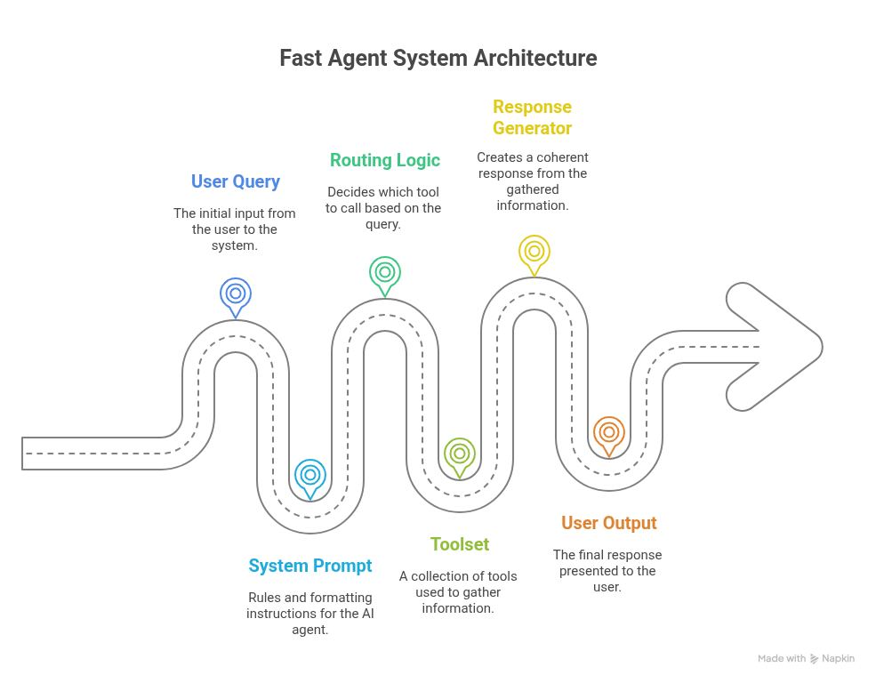
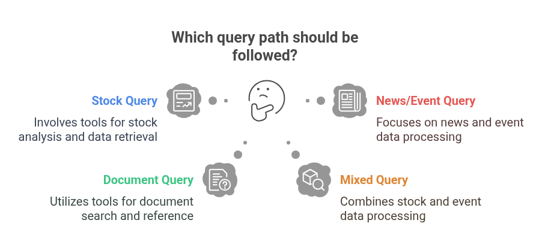

# Fast Agent (Lite) Architecture

## Introduction

**Fast Agent (Lite)** is a smart, AI-powered assistant to deliver timely and accurate insights about companies, markets, and user-uploaded internal documents. It enhances user queries using advanced search tools, intelligent document retrieval, and structured response generation for clarity, credibility, and brand-aligned communication.

This document provides a comprehensive technical overview of Fast Agent, covering:

* High-level architecture and workflow
* Prompt design and response logic
* Tools in use (what, when, why)
* Real-life usage scenarios
* High-level code structure and API flow

It is intended for engineering teams, prompt designers, and anyone onboarding or maintaining the system.

---

## 1. Architecture Overview

Fast Agent follows a **modular, multi-step architecture** that interprets user queries, retrieves relevant data using specialized tools, and generates clear, well-cited responses.

### **Core Workflow**

1. **User Query:**
   The agent receives a natural language question (e.g., “Why is Tesla’s stock falling?”).

2. **Prompt Formatting:**
   The system formats the query using a predefined instruction set governing tone, structure, tool use, citations, and safety.

3. **Routing Logic:**
   A control layer determines which tool(s) to trigger based on the query’s intent (e.g., finance, news, document lookup).

4. **Tool Execution:**
   The chosen tool(s) fetch relevant data (e.g., ticker lookup, stock prices, news, internal document search).

5. **Response Generation:**
   The LLM generates a clear, well-cited markdown response using all retrieved data.

6. **Output to User:**
   The final response is delivered, including inline sources, tables (if needed), and a polite, brand-aligned tone.

### **Key Components**

| Component          | Role                                      |
| ------------------ | ----------------------------------------- |
| System Prompt      | Controls behavior, formatting, and tone   |
| Routing Logic      | Decides which tools to use for each query |
| Tools              | Fetch data from APIs or internal DBs      |
| Response Generator | Composes the final markdown output        |

---

## 2. Prompt Design and Behavior Rules

The agent’s personality, structure, and logic are enforced by a **system prompt** — a detailed set of instructions that ensure consistency, clarity, and brand alignment.

### **Key Prompt Behaviors**

| Behavior                 | What It Ensures                                              |
| ------------------------ | ------------------------------------------------------------ |
| Tone & Brand Voice       | Friendly, respectful, professional tone                      |
| Tool Usage Order         | E.g., always resolve ticker before fetching stock data       |
| Citation Format          | All facts are cited inline: `[SOURCE](https://...)`          |
| User Context Tracking    | Remembers preferences (e.g., user’s preferred name)          |
| Duplicate Query Handling | Summarizes prior answer, asks clarifying intent              |
| Sensitive Query Handling | Compassionate, avoids rudeness and technical jargon          |
| No Technical Disclosures | Never reveals backend models, raw APIs, or system components |
| API Question Handling    | Brand-safe answers)        |

#### **Prompt Evolution and Fixes**

* **Inline citations:** Now always appear after facts, not grouped at the end.
* **Blocked disclosures:** Technical details (like “powered by OpenAI”) are hidden.
* **Polite safety:** Offensive queries receive kind, positive responses.
* **Brand-safe API answers:** Evasive but friendly responses to API questions.

#### **Ongoing Improvements**

* **Thread context:** Some follow-up queries can reference the wrong message; this prompt logic is being refined (expected fix: June 26).

---

## 3. Tools in Use

Fast Agent uses **four production-ready tools**. Each is triggered automatically according to the query — the user never selects tools directly.

### **Tool Summary**

| Tool Name                  | Purpose                                         | When Triggered                                          |
| -------------------------- | ----------------------------------------------- | ------------------------------------------------------- |
| `search_company_info`      | Resolves company names to stock tickers         | Query mentions a company (e.g., “Tesla”)                |
| `get_stock_data`           | Retrieves stock prices/trends for a ticker      | After `search_company_info`, if stock data is requested |
| `advanced_internet_search` | Finds recent news/events on companies or topics | Query involves current events, news, or macro themes    |
| `search_qdrant_tool`       | Searches user-uploaded files via vector search  | Query references uploaded/internal document             |

### **Tool Call Examples**

* **Company Stock:**
  *“Why is Tesla stock falling?”*
  → `search_company_info` → `get_stock_data` → `advanced_internet_search`
* **News/Event Query:**
  *“How will the Israel-Iran war affect Indian markets?”*
  → `advanced_internet_search`
* **Uploaded File:**
  *“What does the audit report say about profits?”*
  → `search_qdrant_tool`

---

## 4. Usage Scenarios

### **Scenario 1: Company Stock Behavior**

**Query:**
“Why is Tesla’s stock falling recently?”
**Tool Calls:**

1. `search_company_info` (finds TSLA)
2. `get_stock_data` (gets price trends)
3. `advanced_internet_search` (gathers news)

**Output:**
Markdown summary, inline sources, optional tables.

---

### **Scenario 2: Geopolitical Event**

**Query:**
“How is the Russia-Ukraine war affecting India’s economy?”
**Tool Calls:**

* `advanced_internet_search` (fetches news/analysis)

**Output:**
Structured explanation, with macro impacts and citations.

---

### **Scenario 3: Uploaded File Reference**

**Query:**
“What does the uploaded audit report say about net income?”
**Tool Calls:**

* `search_qdrant_tool` (semantic document search)

**Output:**
Relevant snippet/paragraph with `[UPLOAD FILE]` citation.

---

### **Scenario 4: Stock Comparison + News**

**Query:**
“Compare HDFC and ICICI performance this month, and tell me if any recent events affected them.”
**Tool Calls:**

1. `search_company_info` (both tickers)
2. `get_stock_data` (both stocks)
3. `advanced_internet_search` (news affecting either)

**Output:**
Side-by-side markdown table with data, news context, and citations.

---

## 5. Code & API Flow

### **Key Code Components**

| File Name               | Description                                                |
| ----------------------- | ---------------------------------------------------------- |
| `fast_agent.py`         | Main agent logic (prompt setup, tool registry, agent core) |
| `internal_db_tools.py`  | Connects to Qdrant DB for document search                  |
| `web_search_tools.py`   | Interfaces with web search APIs                            |
| `finance_data_tools.py` | Connects to financial APIs for company/ticker data         |

### **APIs Used in Production**

| API                     | Purpose                                          |
| ----------------------- | ------------------------------------------------ |
| Financial Modeling Prep | Resolves company to ticker, fetches stock prices |
| Tavily Search API       | Advanced news/internet search                    |
| Qdrant Vector DB        | Embeds and retrieves uploaded documents          |

APIs are **abstracted behind tools** — users never see technical details.

---

### **Simplified System Flow**

1. **User query received**
2. **Prompt formatted** (tone, logic, rules)
3. **Agent chooses tool(s)**
4. **Tool(s) fetch real data**
5. **LLM generates markdown output with citations**
6. **User receives final answer**

---

### **Detailed Step-by-Step Example**

1. **User Input:**
   “Why is HDFC stock falling?”
2. **Prompt Formatting:**
   Enforces rules (tone, tool use, citations, brand safety)
3. **Routing Logic:**

   * Detects company+stock query
   * Calls:

     * `search_company_info` (to get the ticker)
     * `get_stock_data` (for price data)
     * `advanced_internet_search` (Tavily API for news)
4. **Tool Results Aggregated:**
   Returns parsed results (text + metadata)
5. **LLM Prompt Finalized:**
   Combines prompt, query, and tool outputs
6. **LLM Response Generation:**
   Writes markdown reply with inline citations
   Example:

   > “HDFC shares fell 3.1% amid regulatory tightening concerns.” \[ECONOMIC TIMES]
7. **User Output:**
   Delivered with soft, friendly tone and structured formatting

---

## 6. Technical Deep Dive

### **Agent Execution Strategy**

* Implemented using **LangGraph** for multi-step, memory-aware execution.
* **Routing**: Tool execution is conditionally routed via prompt cues, keyword analysis, and semantic matches.
* **Tool Chaining**: Some queries require sequenced tools (e.g., resolve ticker → get stock → fetch news).
* **State Management**: Maintains memory/cache across turns.

### **Prompt Formatting & Memory**

* Each execution uses:

  * **SYSTEM\_PROMPT** (static, brand-safe)
  * **Tool Results** (dynamic)
  * **Current User Query**
  * **Prior context** (for follow-ups)
* **Instruction Prefixes** enforce markdown citations, tone, and brand safety.

### **Tool Integration Details**

| Tool Name                  | Backend Logic                                    |
| -------------------------- | ------------------------------------------------ |
| `search_company_info`      | Company Profile API, with India/US fallback  |
| `get_stock_data`           | Historical Price API, flexible range support |
| `advanced_internet_search` | Tavily API (article parsing and summarization)   |
| `search_qdrant_tool`       | Qdrant semantic search, file ID filtering        |

### **Tool Control (LangGraph)**

* **Nodes** represent tool decisions/response formatting/fallbacks
* **Edges** represent logic paths

  * e.g., “If ticker found → go to stock tool”
  * “If no Qdrant match → fallback message”
* **Conditional branches** per tool; tool called only once per step to prevent loops

### **Qdrant Document Search**

* Uploads are chunked, embedded, and stored with metadata.
* User queries embedded and matched to chunks (vector search).
* Results are ranked/filtered, passed into LLM for answer generation.

### **Output Post-Processing**

* After LLM reply:

  * Rendered as markdown
  * Inline citations are verified/formatted
  * Length/tone checks (no negative, judgmental, or robotic responses)

---

## 7. Summary

**Fast Agent (Insight Agent)** offers a robust, modular, and brand-safe approach to answering market, company, and internal document questions using AI.
Its architecture separates prompt logic, tool routing, data fetching, and LLM-based response generation — supporting clarity, credibility, and easy future maintenance.

---

## Appendix

* For prompt tuning, see the `fast_agent.py` system prompt block.
* For new tool integrations, follow the patterns in `web_search_tools.py` and `internal_db_tools.py`.
