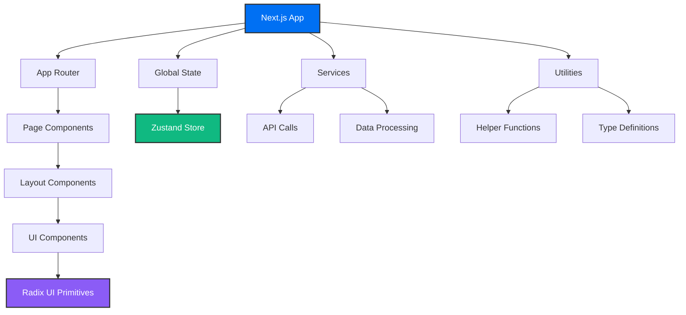

# 🚀 Frontend Dashboard Application

<div align="center">


**A modern, feature-rich frontend application built with Next.js, React, and TypeScript**

[Demo](#) • [Documentation](#) • [Report Bug](#) • [Request Feature](#)

</div>

## 📋 Table of Contents

- [🎯 Overview](#-overview)
- [✨ Features](#-features)
- [🏗️ Architecture](#️-architecture)
- [🛠️ Tech Stack](#️-tech-stack)
- [⚡ Quick Start](#-quick-start)
- [📁 Project Structure](#-project-structure)
- [🎨 UI Components](#-ui-components)
- [🗺️ Maps Integration](#️-maps-integration)
- [📊 Data Visualization](#-data-visualization)
- [🧪 Development](#-development)
- [🤝 Contributing](#-contributing)
- [📄 License](#-license)

## 🎯 Overview

This is a comprehensive frontend dashboard application built with modern web technologies. It features a modular architecture with reusable components, advanced data visualization, interactive maps, and a responsive design system.

## ✨ Features

### 🎨 **Modern UI/UX**
- ✅ Responsive design with Tailwind CSS
- ✅ Component-based architecture with Radix UI
- ✅ Smooth animations with Framer Motion
- ✅ Toast notifications with Sonner

### 📊 **Data Visualization**
- ✅ Interactive charts with Recharts
- ✅ Sparkline charts for trends
- ✅ Excel/CSV data processing
- ✅ Real-time data updates

### 🗺️ **Mapping & Geospatial**
- ✅ Interactive maps with MapLibre GL
- ✅ Deck.gl for advanced visualizations
- ✅ Location-based features

### 🔧 **Developer Experience**
- ✅ TypeScript for type safety
- ✅ ESLint for code quality
- ✅ Hot reload development
- ✅ Modular component structure

## 🏗️ Architecture



## 🛠️ Tech Stack

<table>
<tr>
<td><strong>Frontend Framework</strong></td>
<td>


</td>
</tr>
<tr>
<td><strong>Language</strong></td>
<td>


</td>
</tr>
<tr>
<td><strong>Styling</strong></td>
<td>


</td>
</tr>
<tr>
<td><strong>UI Components</strong></td>
<td>


</td>
</tr>
<tr>
<td><strong>Data Visualization</strong></td>
<td>


</td>
</tr>
<tr>
<td><strong>Maps</strong></td>
<td>


</td>
</tr>
<tr>
<td><strong>State Management</strong></td>
<td>


</td>
</tr>
</table>

## ⚡ Quick Start

### Prerequisites

- **Node.js** (v18 or higher)
- **npm** or **yarn** package manager

### Installation

1. **Clone the repository**
   ```bash
   git clone <repository-url>
   cd frontend
   ```

2. **Install dependencies**
   ```bash
   npm install
   # or
   yarn install
   ```

3. **Set up environment variables**
   ```bash
   cp .env.example .env.local
   # Edit .env.local with your configuration
   ```

4. **Start the development server**
   ```bash
   npm run dev
   # or
   yarn dev
   ```

5. **Open your browser**
   ```
   http://localhost:3000
   ```

## 📁 Project Structure

```
📦 frontend/
├── 📁 public/                    # Static assets
├── 📁 src/
│   ├── 📁 app/                   # Next.js App Router
│   │   ├── 📁 (auth)/           # Authentication routes
│   │   │   ├── 📁 login/
│   │   │   └── 📁 signup/
│   │   ├── 📁 (chats)/          # Chat functionality
│   │   ├── 📁 (dashboard)/      # Dashboard pages
│   │   ├── 📁 map/              # Map-related pages
│   │   ├── 📁 onboarding/       # User onboarding
│   │   ├── 📁 share/            # Sharing functionality
│   │   ├── 📄 favicon.ico
│   │   ├── 📄 globals.css       # Global styles
│   │   └── 📄 layout.tsx        # Root layout
│   ├── 📁 components/           # Reusable components
│   │   ├── 📁 charts/           # Chart components
│   │   ├── 📁 chat/             # Chat components
│   │   ├── 📁 icons/            # Custom icons
│   │   ├── 📁 layout/           # Layout components
│   │   ├── 📁 maps/             # Map components
│   │   ├── 📁 markdown/         # Markdown renderer
│   │   └── 📁 ui/               # UI primitives
│   │       ├── 📄 LoaderLsx     # Loading components
│   │       └── 📄 tooltip-content.tsx
│   ├── 📁 hooks/                # Custom React hooks
│   ├── 📁 lib/                  # Utility libraries
│   ├── 📁 services/             # API services
│   ├── 📁 store/                # State management
│   ├── 📁 types/                # TypeScript definitions
│   └── 📁 utils/                # Helper utilities
├── 📄 .env                      # Environment variables
├── 📄 .gitignore               # Git ignore file
├── 📄 components.json          # Shadcn/ui config
├── 📄 eslint.config.mjs        # ESLint configuration
├── 📄 next-env.d.ts            # Next.js types
├── 📄 next.config.ts           # Next.js configuration
├── 📄 package-lock.json        # Lock file
├── 📄 package.json             # Dependencies
└── 📄 README.md                # This file
```

## 🎨 UI Components

The application uses a comprehensive design system built on top of Radix UI:

### Core Components
- **Accordion** - Collapsible content sections
- **Alert Dialog** - Modal confirmations
- **Aspect Ratio** - Responsive containers
- **Checkbox** - Form inputs
- **Dialog** - Modal windows
- **Dropdown Menu** - Context menus
- **Select** - Dropdown selections
- **Tabs** - Tabbed interfaces
- **Toast** - Notification system
- **Tooltip** - Contextual help

### Custom Components
- **Charts** - Data visualization components
- **Chat** - Real-time messaging interface
- **Maps** - Interactive mapping components
- **Markdown** - Rich text rendering
- **Layout** - Page structure components

## 🗺️ Maps Integration

The application features advanced mapping capabilities:

```typescript
// Example map component usage
import { MapContainer } from '@/components/maps'

export default function MapPage() {
  return (
    <MapContainer
      initialViewState={{
        longitude: -122.4,
        latitude: 37.8,
        zoom: 14
      }}
      layers={[
        // Deck.gl layers
      ]}
    />
  )
}
```

**Features:**
- Interactive pan and zoom
- Custom markers and popups
- Data-driven visualizations
- Responsive design

## 📊 Data Visualization

Built-in charting capabilities with Recharts:

```typescript
// Example chart usage
import { LineChart, BarChart } from '@/components/charts'

export default function Dashboard() {
  return (
    <div className="grid gap-4">
      <LineChart data={timeSeriesData} />
      <BarChart data={categoryData} />
    </div>
  )
}
```

**Chart Types:**
- Line charts for trends
- Bar charts for comparisons
- Sparklines for compact metrics
- Custom visualizations

## 🧪 Development

### Available Scripts

| Command | Description |
|---------|-------------|
| `npm run dev` | Start development server |
| `npm run build` | Build for production |
| `npm run start` | Start production server |
| `npm run lint` | Run ESLint |

### Development Workflow

1. **Create a new feature branch**
   ```bash
   git checkout -b feature/your-feature-name
   ```

2. **Make your changes**
   - Follow the existing code style
   - Add tests for new functionality
   - Update documentation as needed

3. **Test your changes**
   ```bash
   npm run lint
   npm run build
   ```

4. **Commit and push**
   ```bash
   git commit -m "feat: add your feature description"
   git push origin feature/your-feature-name
   ```

### Code Style Guidelines

- Use TypeScript for all new files
- Follow the existing folder structure
- Use meaningful component and variable names
- Add JSDoc comments for complex functions
- Ensure responsive design for all components

## 🤝 Contributing

We welcome contributions! Please follow these steps:

### 🔄 Contribution Process

1. **Fork the repository**
2. **Create your feature branch** (`git checkout -b feature/AmazingFeature`)
3. **Commit your changes** (`git commit -m 'Add some AmazingFeature'`)
4. **Push to the branch** (`git push origin feature/AmazingFeature`)
5. **Open a Pull Request**

### 📝 Pull Request Guidelines

- Provide a clear description of the changes
- Include screenshots for UI changes
- Ensure all tests pass
- Update documentation if needed
- Follow the existing code style

### 🐛 Bug Reports

When reporting bugs, please include:

- **Steps to reproduce** the issue
- **Expected behavior**
- **Actual behavior**
- **Screenshots** (if applicable)
- **Environment details** (OS, browser, Node.js version)

### 💡 Feature Requests

For feature requests, please provide:

- **Clear description** of the feature
- **Use case** and benefits
- **Mockups or examples** (if applicable)

## 📄 License

This project is licensed under the **MIT License**.

---

<div align="center">

**Made with ❤️ by the Frontend Team**

[⬆ Back to Top](#-frontend-dashboard-application)

</div>
